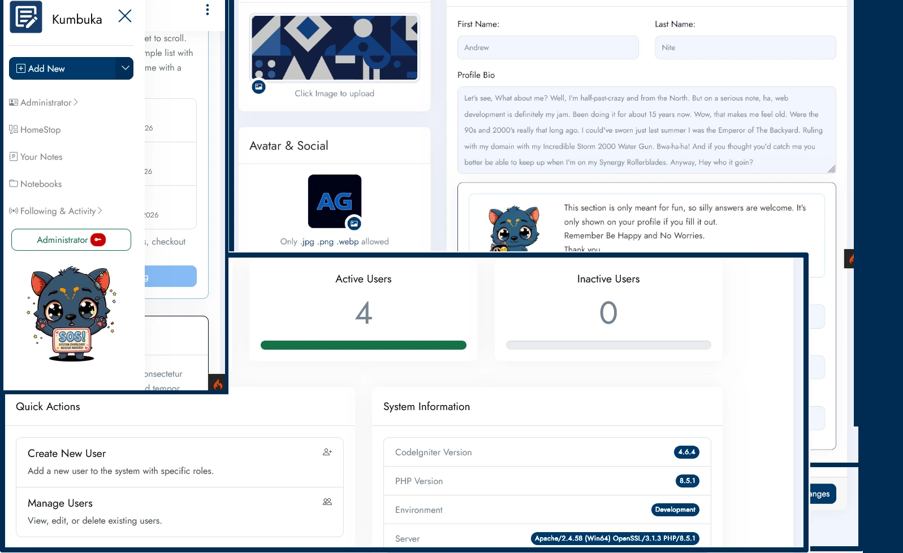

# Kumbuka: Notebook Application
Kumbuka is a simple MVC-driven Notes/Record Management Web Application built as a portfolio project to demonstrate backend architecture, database normalization, and secure coding practices using the [**CodeIgniter Framework**](https://github.com/cirebonweb/codeigniter4-starter-kit).

## 💡 Key Features Showcase
* **User Authentication:** Secure registration, password hashing, and role-based access control.
* **RESTful API Endpoint:** Demonstrates CodeIgniter's API routing and handling JSON payloads.
* **CSRF & Security Protection:** Fully implemented CSRF token validation on all data-submitting forms.
* **Interactive Dashboard:** Dynamic views rendering data fetched via CodeIgniter models.

## 🛠️ Tech Stack & Architecture
* **Backend:** PHP 8.x, CodeIgniter Framework (MVC Architecture)
* **Database:** MySQL / PostgreSQL
* **Frontend:** Bootstrap, JavaScript (minimal jQuery)
* **Tools Used:** Composer and XAMPP

## Contents
- [Tech Stach](#tech-stack)
    - [Live Version Demo](#click-here-for-live-verison)
- [Updates](#updates)
- [Getting started](#getting-started)
    - [Server Requirements](#server-requirements)
    - [Setup Localhost](#setup-localhost)
    - [Credits](#include-dependencies)
    - [License](#license)
- [Live Demo Information](#live-demo-information)
    - [Privacy Notice](#privacy-notice)
    - [Terms and Conditions](#privacy-policy-for-kumbuka)

### Tech Stack

### [Click here for Live Verison](https://kumbuka.ngendesign.com)
*For more about the Live sandbox version's Privacy Notice and Terms and Conditions you can check them out here*

***Check Out:*** The project's [TODO.md list](./TODO.md) and [dev-notes file](./dev-notes.md) to see changelogs and planned updates and additions. [Here's a Google Doc]( https://docs.google.com/document/d/1-cpAjEaZSQvS6A5ZcgJN0wKay-YI9Nf7xm1bFfvkC3s/edit?usp=sharing) with some applications development plans. 

### Updates

## Current 1.0.0
Up and running.

#### 2.5.0-alpa  
These are some of the updates made from the last update
- Added Profile visibility controls

## Build w/ CodeIgniter 4.x
CodeIgniter is a PHP full-stack web framework that is light, fast, flexible and secure. More information can be found at the [official site](https://codeigniter.com).

You can read the [user guide](https://codeigniter.com/user_guide/) corresponding to the latest version of the framework.

### Included Packages & Libraries
- CodeIgniter 4 User Guide: https://codeigniter.com/user_guide/index.html
- Shield Documentation: https://shield.codeigniter.com
- Starter CI4 App: https://github.com/ilhamlutfi/starter-ci4
- CI4 Shield Starter: https://github.com/SdVVentures/ci4-shield-starter
- Tatter\Preferences: https://github.com/tattersoftware/codeigniter4-preferences

## Getting started

***Required***: This repository holds a composer-installable app starter.
It has been built from the [development repository](https://github.com/codeigniter4/CodeIgniter4) and [Sheild](https://shield.codeigniter.com/)  - The official authentication and authorization framework for CodeIgniter 4 

### *See [dev-note.md](./dev-notes.md) to see the Application Directory Structure*

Run `composer install` whenever there is a new release of the framework.

**Important**: When updating, check the release notes to see if there are any changes you might need to apply
to your `app` folder. The affected files can be copied or merged from `vendor/codeigniter4/framework/app`.

## **Need to update setup steps**

## Server Requirements

PHP version 8.5 or higher is required, with the following extensions installed:
- [intl](http://php.net/manual/en/intl.requirements.php)
- [mbstring](http://php.net/manual/en/mbstring.installation.php)

Additionally, make sure that the following extensions are enabled in your PHP:

- json (enabled by default - don't turn it off)
- [mysqlnd](http://php.net/manual/en/mysqlnd.install.php) if you plan to use MySQL
- [libcurl](http://php.net/manual/en/curl.requirements.php) if you plan to use the HTTP\CURLRequest library

### Setup Localhost
1. Download or clone the repo to your `localhost` folder.
2. Change directory to `cd ngen-kumbuka-ci` folder.
3. Import `ngen-bootsnippets-ci/database.sql` to your MySQL or MariaDB Server, create a user and grant all rights to the imported `DB`
4. Rename `env` to `.env`
5. (Optional) Change the App URL to `app.baseURL = 'http://localhost/ngen-kumbuka-ci/public/'` if nedded.
6. Update database config, change the lines where `database.default.database =`, `database.default.username =`, `database.default.password =`, and `database.default.hostname =` in .env file to match your database credentials.
7. Run the Migrates: `php spark migrate --all`.
8. Launch the development server (Two options)
    1. Run `php spark serve` to launch a built-in development server.
    2. Or if using VS Code Tasks
        1. **Open the Command Palette**: Press `Ctrl+Shift+P` (Windows/Linux) or `Cmd+Shift+P` (macOS).
        2. **Type "run task"**: Start typing `Tasks: Run Task` into the search bar and select it from the dropdown list.
        3. **Select the task**: A list of available tasks (auto-detected or those defined in your tasks.json file) will appear. Select `Run Compser Server (Kubmuka)` to the launch a built-in development server the integrated terminal.
9. Alternatively, you can browse the app using a web browser, by entering this URL address `http://localhost:8080` or the App URL used in `app.baseURL`.

## Credits

Got the be grateful for these projects and creators that shared them. They've help in The Bootsnippets.com projects development. Much thanks.

#### Tatter\Preferences:
Persistent user-specific settings for CodeIgniter 4
https://github.com/tattersoftware/codeigniter4-preferences

## License
"Copyright (c) 2026 N-Gen Design. All rights reserved." but feel free still have fun.

### Live Demo Information

## 🔒 Privacy Notice
This is a portfolio project built to showcase development practices with CodeIgniter. 
* **No Collection:** The live demonstration of this application does not collect, log, or store any personal data. 
* **Local Sessions:** Any interaction or input is handled strictly in-memory or via functional session cookies to demonstrate framework mechanics. No data persists after you close your browser.

# Terms and Conditions

**Last Updated: July 2026**

Welcome to [Your Application Name] (the "Application"). This website is a public portfolio project created solely to demonstrate web development proficiency, backend architecture, and design implementations using the CodeIgniter framework. 

By accessing or using this Application, you acknowledge that you have read, understood, and agreed to be bound by these Terms and Conditions. If you do not agree, please discontinue use of the site immediately.

# Privacy Policy for Kumbuka

**Last Updated: July 2026**

Welcome to [Your App Name]. This web application was developed solely as a portfolio project to demonstrate web development and programming proficiency using the CodeIgniter framework. 

### 1. Information We Collect
Because this is a demonstration application, we minimize data collection as much as possible:
* **User-Submitted Data:** If you create a test account, fill out a sample form, or post mock data, that information is stored in our database purely to demonstrate application functionality. Please do not enter real, sensitive personal information.
* **Automated Technical Data:** Like most websites, our server may automatically log standard technical data such as your IP address, browser type, and the time of your visit. 

### 2. Cookies and Sessions
This application uses standard, built-in CodeIgniter session cookies (such as `ci_session`) to ensure the website functions correctly, maintains your session state, and protects against Cross-Site Request Forgery (CSRF) attacks. These cookies do not track your browsing habits outside of this site.

### 3. How Your Data is Used and Shared
Any data you enter into this application is used strictly to display the app's features. We do not sell, rent, trade, or share your data with any third parties. 

### 4. Data Retention and Security
Data entered into this demonstration site is considered temporary and may be deleted or reset at any time without notice. While we implement standard framework security measures, this site is not intended to secure highly sensitive data. 

### 5. Contact Information
If you have any questions about this project or the CodeIgniter implementation, please contact the developer via their primary portfolio website or [Your Contact Email/GitHub Link].

